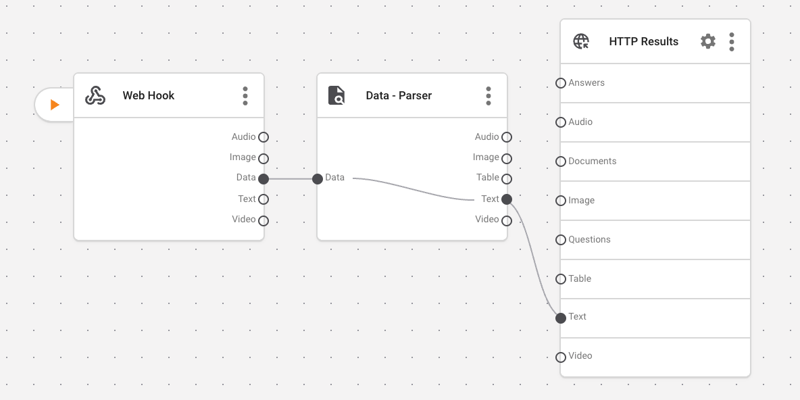
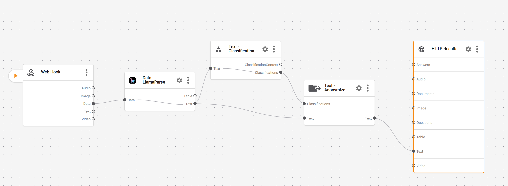
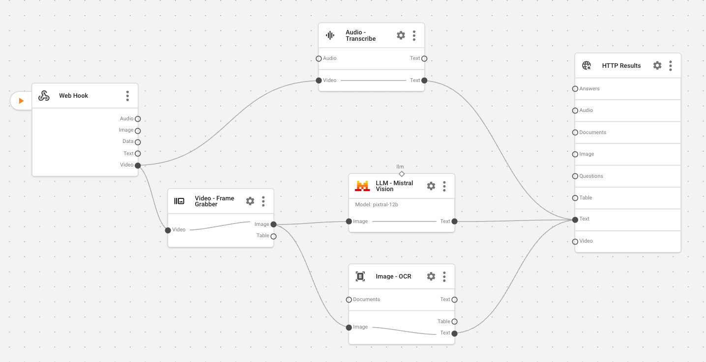
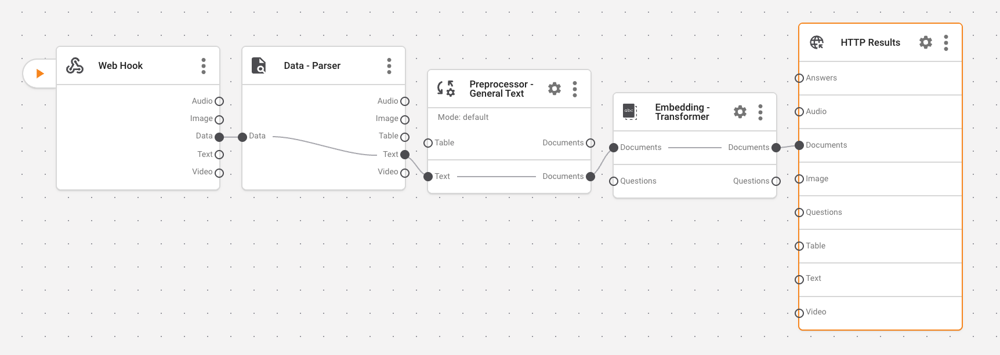

# Aparavi SDK Demos

AI-powered document processing with parsing, classification, and PII anonymization.


## 🚀 Quick Start

### 1. Get your API key
- **US customers**: [dtc.aparavi.com/usage](https://dtc.aparavi.com/usage)
- **EU customers**: [dtc.aparavi.eu/usage](https://dtc.aparavi.eu/usage)

### 2. Setup (one-time)

```bash
cd Aparavi-SDK-Demos
copy env.example .env   # Windows (or cp env.example .env on Mac/Linux)
```

Edit `.env`: 
 - Add your API key
 - Set APARAVI_BASE_URL to your server:
    - **US customers**: https://eaas.aparavi.com/
    - **EU customers**: https://eaas.aparavi.eu/

```env
APARAVI_API_KEY=your-api-key-here
APARAVI_BASE_URL=your-server-here
```

### 3. Choose your demo

Below are the four demos. Open the linked notebook for each, which corresponds to the shown pipeline diagram.

#### A) Document Processor


- **Notebook**: `notebooks/document_processor_demo.ipynb`
- **Pipeline**: `pipelines/document_processor_pipeline.json`

Run:
```bash
jupyter notebook notebooks/document_processor_demo.ipynb
```

#### B) Anonymize


- **Notebook**: `notebooks/anonymize_demo.ipynb`
- **Pipeline**: `pipelines/anonymize_pipeline.json`

Run:
```bash
jupyter notebook notebooks/anonymize_demo.ipynb
```

#### C) Video Processor


- **Notebook**: `notebooks/video_processor_demo.ipynb`
- **Pipeline**: `pipelines/video_processor_pipeline.json`

Run:
```bash
jupyter notebook notebooks/video_processor_demo.ipynb
```

#### D) Chunk and Embed


- **Notebook**: `notebooks/chunk_embed_demo.ipynb`
- **Pipeline**: `pipelines/chunk_embed_pipeline.json`

Run:
```bash
jupyter notebook notebooks/chunk_embed_demo.ipynb
```

## 📚 Learn More

- **Website**: [aparavi.com](https://aparavi.com)
- **SDK Documentation**: [GitHub](https://github.com/AparaviSoftware/aparavi-dtc-sdk)
- **Support**: support@aparavi.com

## 📄 License

MIT License - see [LICENSE](LICENSE) file for details.

---

**Built with ❤️ using Aparavi Data Toolchain SDK**