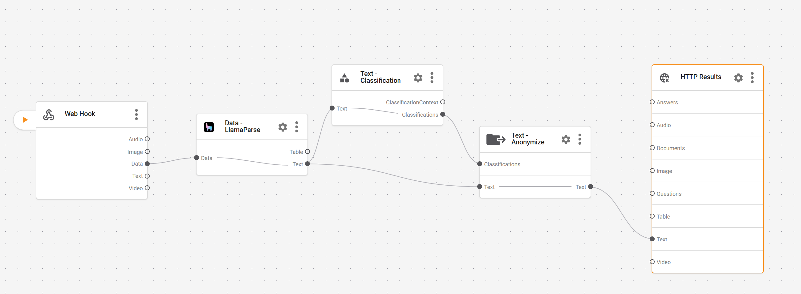

# Aparavi Pipeline Demo

A demonstration of the Aparavi Data Toolchain SDK for document processing with AI-powered parsing, classification, and anonymization.

## 🚀 Features

- **Document Parsing**: Process PDFs and other documents using LlamaParse with AI models
- **Data Classification**: Automatically detect sensitive data (SSN, PII, NIST compliance)
- **Text Anonymization**: Redact sensitive information with customizable anonymization
- **Pipeline Orchestration**: Chain multiple processing components together
- **Webhook Support**: Process documents via webhook endpoints

## 📋 Prerequisites

- Python 3.8 or higher
- Aparavi API credentials ([Get your API key](https://core.aparavi.com/usage/))
- pip package manager

## 🛠️ Installation

### Quick Setup (Recommended)

1. **Clone the repository**
   ```bash
   git clone <your-repo-url>
   cd aparavi-pipeline-demo
   ```

2. **Run the setup script**
   ```bash
   python setup.py
   ```
   This will:
   - Create `.env` file from template
   - Install dependencies
   - Create necessary directories
   - Guide you through configuration

### Manual Setup

1. **Install dependencies**
   ```bash
   pip install -r requirements.txt
   ```

2. **Configure credentials**
   
   Copy the example environment file:
   ```bash
   cp env.example .env
   ```
   
   Edit `.env` with your credentials:
   ```env
   APARAVI_API_KEY=your-api-key-here
   APARAVI_BASE_URL=https://eaas.aparavi.com/
   ```

   > **Note**: For development environment, use `https://eaas-dev.aparavi.com/`

## 📁 Project Structure

```
aparavi-pipeline-demo/
├── README.md                    # This file
├── requirements.txt             # Python dependencies
├── .env.example                # Environment variables template
├── pipelines/                   # Pipeline configurations
│   └── main_pipeline.json      # Main webhook pipeline with full features
├── src/                         # Source code
│   ├── run_pipeline.py         # Main pipeline runner
│   ├── test_connection.py      # Connection tester
│   └── utils.py                # Helper functions
├── notebooks/                   # Jupyter notebooks
│   └── demo.ipynb              # Interactive demo
└── samples/                     # Sample documents
    └── sample.pdf              # Example PDF for testing
```

## 🎯 Quick Start

### 1. Test your connection
```bash
python src/test_connection.py
```

### 2. Process a document
```bash
python src/run_pipeline.py --file samples/sample.pdf --pipeline pipelines/main_pipeline.json
```

### 3. Interactive demo
```bash
jupyter notebook notebooks/demo.ipynb
```

## 📖 Usage Examples

### Basic Document Processing

```python
from aparavi_dtc_sdk import AparaviClient

# Initialize client
client = AparaviClient(
    base_url="https://eaas.aparavi.com/",
    api_key="your-api-key"
)

# Execute pipeline
result = client.execute_pipeline_workflow(
    pipeline="pipelines/main_pipeline.json",
    file_glob="./samples/*.pdf"
)

print(result)
```

### Using Predefined Pipelines

```python
from aparavi_dtc_sdk import AparaviClient, PredefinedPipelines

client = AparaviClient(
    base_url="https://eaas.aparavi.com/",
    api_key="your-api-key"
)

# Use built-in pipeline
result = client.execute_pipeline_workflow(
    pipeline=PredefinedPipelines.SIMPLE_PARSER,
    file_glob="./samples/*.pdf"
)
```

## 🔧 Pipeline Components

### Visual Pipeline Builder

Aparavi provides a visual pipeline builder for creating and configuring document processing workflows:



The visual builder shows the complete data flow:
- **Web Hook** (Source): Accepts documents via HTTP endpoint for scalable processing
- **LlamaParse**: AI-powered document parsing using Anthropic Claude (Sonnet 4.0) for intelligent text extraction
- **Text Classification**: Identifies sensitive data patterns (SSN, PII, NIST compliance)
- **Text Anonymize**: Redacts identified sensitive information with customizable anonymization
- **HTTP Results**: Returns processed documents with multiple output formats

This webhook-based architecture enables:
- **Scalable Processing**: Handle multiple documents concurrently
- **API Integration**: Easy integration with existing systems
- **Real-time Processing**: Process documents as they arrive
- **Cloud-Native**: Deploy as microservices or serverless functions

### Available Components

1. **Dropper/Webhook**: Input sources for documents
   - Dropper: Direct file upload
   - Webhook: HTTP endpoint for document submission
2. **LlamaParse**: AI-powered document parsing
   - Supports multiple AI models (Anthropic, OpenAI)
   - Outputs in various formats (Markdown, JSON, Text)
3. **Classify**: Sensitive data detection
   - SSN/Tax ID detection
   - PII identification
   - Compliance checking (NIST, CCPA)
4. **Anonymize**: Text redaction
   - Customizable anonymization characters
   - Multiple anonymization profiles
5. **Response**: Output handling
   - Multiple output lanes (Text, Audio, Documents, etc.)

### Pipeline Configuration

Pipelines can be created in two ways:

#### 1. Visual Pipeline Builder
Use the Aparavi console to visually design your pipeline:
1. Drag and drop components from the palette
2. Connect components by drawing connections between nodes
3. Configure each component's settings
4. Export the pipeline as JSON

#### 2. JSON Configuration
Define pipelines programmatically in JSON format:

```json
{
  "name": "Full Document Processing Pipeline",
  "source": "webhook_1",
  "components": [
    {
      "id": "webhook_1",
      "provider": "webhook",
      "config": {
        "mode": "Source",
        "type": "webhook"
      }
    },
    {
      "id": "llamaparse_1",
      "provider": "llamaparse",
      "config": {
        "parse_mode": "parse_page_with_lvm",
        "result_type": "markdown",
        "lvm_model": "anthropic-sonnet-4.0"
      }
    },
    {
      "id": "classify_1",
      "provider": "classify",
      "config": {
        "classifications": []
      }
    },
    {
      "id": "anonymize_text_1",
      "provider": "anonymize_text",
      "config": {
        "profile": "glinerMergedLarge"
      }
    }
  ]
}
```

### Data Flow

The pipeline processes documents through the following stages:

1. **Input**: Documents are received via dropper or webhook
2. **Parsing**: LlamaParse extracts text and structure using AI
3. **Classification**: Sensitive data patterns are identified
4. **Anonymization**: Classified sensitive data is redacted
5. **Output**: Processed documents are returned via HTTP response

Each component can have multiple input and output lanes for different data types:
- **Text**: Plain text content
- **Data**: Structured data (JSON)
- **Classifications**: Identified sensitive data patterns
- **Audio/Video**: Media content
- **Documents**: Original and processed files

## 🧪 Testing

Run the test suite:
```bash
python -m pytest tests/
```

## 🐛 Troubleshooting

### Common Issues

1. **Missing credentials**
   - Ensure `.env` file exists with valid API credentials
   - Check API key permissions in Aparavi console

2. **Pipeline validation errors**
   - Verify component IDs match in pipeline configuration
   - Ensure `source` field references an existing component

3. **File processing errors**
   - Check file exists and matches the glob pattern
   - Verify file format is supported

### Debug Mode

Enable verbose logging:
```bash
export APARAVI_DEBUG=true
python src/run_pipeline.py --verbose
```

## 📚 Documentation

- [Aparavi SDK Documentation](https://github.com/AparaviSoftware/aparavi-dtc-sdk)
- [API Reference](https://docs.aparavi.com/api)
- [Pipeline Builder Guide](https://docs.aparavi.com/pipelines)

## 🤝 Contributing

Contributions are welcome! Please feel free to submit a Pull Request.

1. Fork the repository
2. Create your feature branch (`git checkout -b feature/AmazingFeature`)
3. Commit your changes (`git commit -m 'Add some AmazingFeature'`)
4. Push to the branch (`git push origin feature/AmazingFeature`)
5. Open a Pull Request

## 📄 License

This project is licensed under the MIT License - see the [LICENSE](LICENSE) file for details.

## 🙏 Acknowledgments

- Aparavi team for the powerful SDK
- LlamaParse for document parsing capabilities
- Contributors and testers

## 📞 Support

For issues and questions:
- Open an issue in this repository
- Contact Aparavi support at support@aparavi.com
- Visit [Aparavi Community Forum](https://community.aparavi.com)

---

**Built with ❤️ using Aparavi Data Toolchain SDK**
